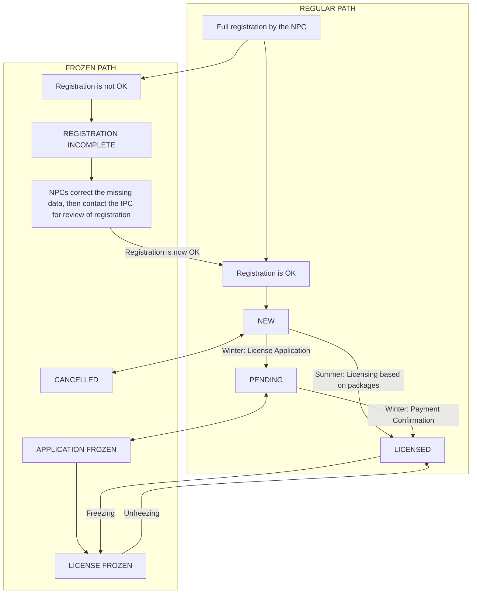

# Licence Overview & Application

The licensing of individual athletes and guides is completed from this screen, which is designed as a step-by-step process to guide NF users through
the process of licensing. Several participants within the same sport may be licensed at once; however, only within one particular sport in one license
process. The licensing of guides of IBSA athletes is determined by the rules in each particular sport, but in principle guides are licensed using the
same process and for the same fees as for licensing other IBSA athletes, and the word athlete will be used for simplicity from here on.

This screen also functions as a search form for already existing licences, in case users want an overview of an NF’s licensed athletes within a sport
or needs information about the status of one particular participant or application.

## Available Athletes, Status and Process

   Figure 5.2 - Possible license statuses and paths

Not all athletes registered in SDMS are available to be licensed immediately, in order to restrict NFs from licensing athletes that are not eligible
to compete in IBSA competitions. However, the fact that an athlete is listed in this section does not mean they are licensed. Athletes are added to
this section in one of two ways:

1. Carried over from previous season. This applies to all athletes that were available in the previous season, as long as they are still listed with
   _Active_ career status.
2. Added as new registrations during the season whether an athlete is registered as licensed within SDMS or not is shown by the license _status_. At
   the beginning of the season, all athletes carried over from the previous season are assigned the license status _New_, and when the licensing
   process is complete for that athlete, the status changes to _Licensed_. All possible statuses, and how they can be changed by the respectively
   authorised users, are shown in Figure 5.2.

Within a season, athletes are not removed from this section. If the athlete is for some reason not eligible to compete, they should be moved into the
frozen path. Their license status will then depend on where they were in the licensing process before the freezing occurred. The athlete can also be
unfrozen if the issue causing ineligibility is resolved. E.g., athletes with incomplete registration would be frozen, but can be unfrozen again and
receive status _New_ if correct documents are uploaded.

## License Search Form

The following criteria are available from the section’s search form:

| Field       | Format                 | Comments                                                                                                                |
|-------------|------------------------|-------------------------------------------------------------------------------------------------------------------------|
| Season      | drop-down box [Season] | obligatory, currently active seasons listed on top. Seasons with read-only status can be selected for archive purposes. |
| Sport       | drop-down box [Sport]  | obligatory, populated upon season choice                                                                                |
| NF          | drop-down box [NF]     | obligatory, automatically selected for you                                                                              |
| ISAS ID     | integer                | search for a particular ID                                                                                              |
| Family Name | text field             |                                                                                                                         |
| Given Name  | text field             |                                                                                                                         |
| Licence No  | text field             | code of issued licence (printed on licence card)                                                                        |
| Invoice No  | text field             | code of invoice for licence or licence package                                                                          |
| Status      | drop-down box          | the license status reflects the progress of the application                                                             |

After selecting the season and sport in the search form, the matching athletes appear in the search grid of _Athlete Licenses_. In addition to
information about their current license status, the date of validity (for licensed athletes) and any comments from IBSA are displayed.

<figure>
    
    <figcaption>Figure 5.3 - License search form action buttons</figcaption>
</figure>

With this search, users can perform a number of actions relating to the license status of the searched athletes. IBSA users can go through the exact
same process as NF users, if they require assistance or are unfamiliar with the process.

NF users can begin the application process by selecting athletes and clicking the _Add to My Team_ button. The application process will be described
in detail in [Selecting and Controlling Teams](licence-management/licence-overview-and-application#selecting-and-controlling-teams) through
[License Application Completion](licence-management/licence-overview-and-application#license-application-completion). Also, the License History
button allows for access to a page with all status changes of a particular athlete, with date and the username responsible for each change listed.

Additionally, IBSA users have three extra buttons available to change the status of a license application: _Freeze_, _Unfreeze_ and _Update_. These
can all be applied to several athletes at a time. The Freezing and Unfreezing buttons are for moving athletes between the frozen and regular paths of
license application: on clicking, a dialogue box is brought up showing the changes between the paths and with a text area for entering any comments.

The date of validity of the license can be changed by clicking the _Update_ button: again, a comment field is provided for entry of reasons for the
update, if necessary.

## Selecting and Controlling Teams

This section describes steps 2-4 in the license application process. After obtaining a list of athletes, users select the athletes to be licensed by
clicking anywhere in the athlete’s search row and then clicking the _Add to My Team_ button (step 2). This updates the counter of athletes in the
_Control your team_ section (step 3) and colours all selected athletes in red. There is also a _Clear My Team_ button, which removes all selected
athletes and returns to the start of step 2; another option to remove athletes is described in the following section, License Application Completion.

> [!NOTE]
> Adding Athletes
>
> 1. Adding athletes from several different search grids with one click is currently not supported. Users from countries with many athletes can
     > change the number of athletes displayed on each page (default 10).
> 2. All athletes in the search grid may be selected for licensing by checking the box in the upper left corner.
> 3. Athletes already licensed may be selected from the grid, but will not be added to the team by the **Add to My Team** functionality.

Once the user has selected all athletes to licence, step 4 is completed by clicking the _License my Team_ button. The user is then taken to the
_License Application Completion_ screen for steps 5 through 7, which are different depending on whether the sport uses packages or individual
licensing.

## License Application Completion

Step 5 is a checking step to ensure that the correct athletes have been transferred from the previous screen. All athletes selected in the previous
process are displayed in a table, with ID, family name, given name and type (athlete or guide). The codes for the NF, season and sport are also shown
here.

Step 6, shown in Figure 5.4, asks the user to select one or several license packages for this application. All packages with free licenses are
displayed and can be selected by clicking the associated row in the grid.

<figure>
    
    <figcaption>Figure 5.4: Step 6, before selection of available packages</figcaption>
</figure>

Clicking the row updates the counter of Licenses from selected packages. If enough licenses are available through the selected package, the required
licenses counter changes colour to green, as shown below. If more packages are required to complete the application, the colour stays red and the
counter is updated to show the remaining number required.

<figure>
    
    <figcaption>Figure 5.5: Step 6, Sufficient packages have been selected</figcaption>
</figure>

The final step of the process is completed by clicking the _Confirm & License_ button. As long as enough packages have been selected to cover the
required amount, the licenses will then be allotted by ISAS automatically. Each licence is assigned an ID for use on the licence card, with season,
sport, nation and a random 8-digit number. The license is also associated with the correct license package, and the current date is stored as the
license’s validity date.

> [!WARNING]
> Assigning a license from a package to an athlete is binding – it is not possible to cancel an athlete’s license in order to get more available
> licenses in the package.

